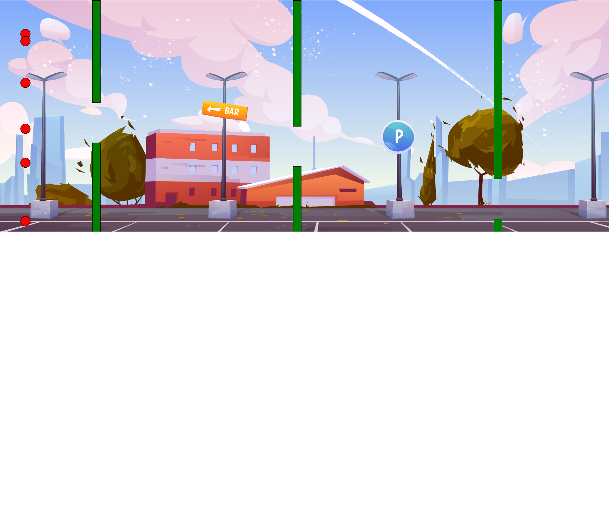

# NEAT
NeuroEvolution of Augmenting Topologies 
Neural Network based Game-Playing Agent trained using Genetic Algorithm for playing Flappy Bird game. 
Visit [this site](https://chiradeepdey.github.io/NEAT/) to see the neural network based flappy bird get trained by GA. Use the slider at the bottom left corner for speeding up the process of training.

